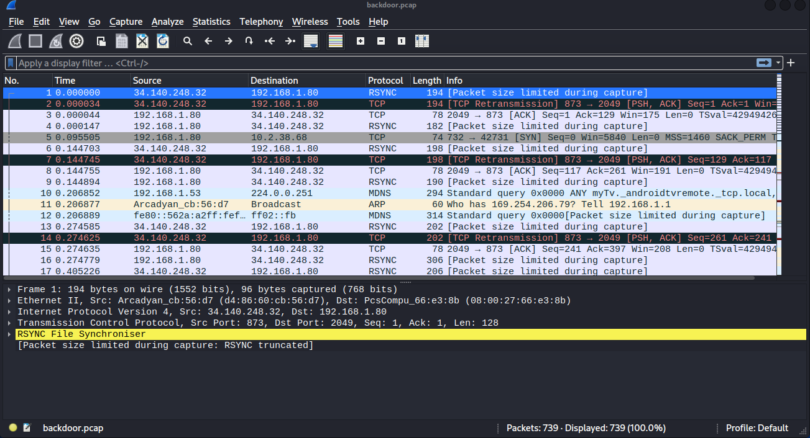
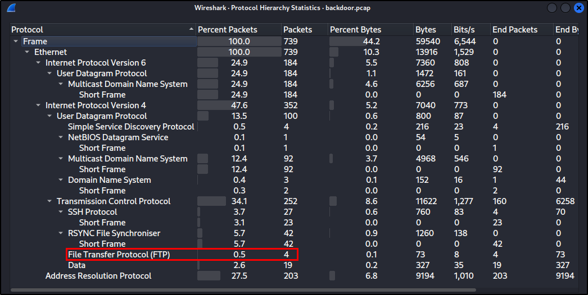
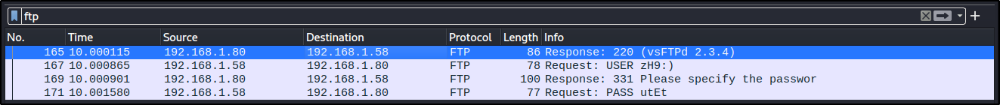
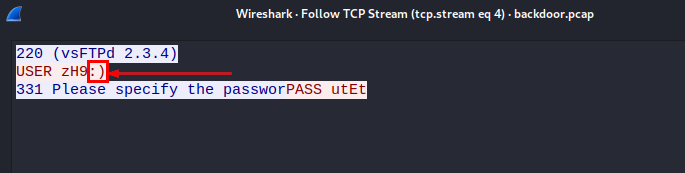

# Backdoor

## Description
Our server compromised due to known vulnerability introduced from many years, Kindly check and identify this flow 

* X: Attack source → EX. “Internal/External”
* Y: The Source IP → x.x.x.x
* Z: CVE Num of the attack → xxx
* W: Destination Mac Address

**Flag format: flag{X:Y:Z:W}**

## Files
[backdoor.pcap](./backdoor.pcap)

## Solution

The first hint is the lab title "Backdoor", so we should look for a backdoor in the pcap file. The second hint is the description "known vulnerability introduced from many years", so we should look for an old vulnerability.

Open the pcap file in Wireshark.

<p align="center">
    
</p>

As we can see there are 739 packets in the pcap file. Let's see the protocols used in these packets.

From Statistics > Protocol Hierarchy we can see that the most used protocol is TCP.

<p align="center">
    
</p>

We can see that there are 4 packets using the protocol "File Transfer Protocol (FTP)". Let's see these packets.

<p align="center">
    
</p>

Follow this TCP Stream.

<p align="center">
    
</p>

It's a login attempt to FTP server but there are symbols in the username that related to a known vulnerability in FTP server.

From this we can find that the attacker IP is **192.168.1.58** and it's an **internal** IP.

The destination MAC address is **08:00:27:66:e3:8b**.

Search for the vulnerabilities of "vsFTPd 2.3.4" and we will find that the vulnerability is **CVE-2011-2523**.


### Flag
```
flag{Internal:192.168.1.58:CVE-2011-2523:08:00:27:66:e3:8b}
```