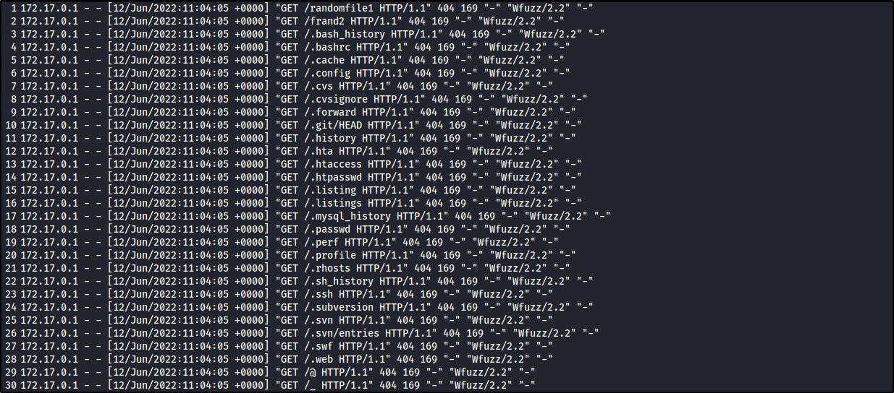
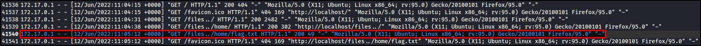

# Beans Detector

## Description

You have received the alert in your company WAF that web attack happened recently. Please check and identify the below details

### Follow the below format in order to submit the flag

* X: Attacker IP Address
* Y: Name of vulnerability scanner used by the attacker
* Z: number of bytes in the sensitive file leaked
* W: Data and time of the successful attack (xx/xx/xxxx:xx:xx:xx)

**Flag Format:** flag{X:Y:Z:W}

## Files

[beansdetectorlogs](./beansdetectorlogs)

## Solution

Let's open the file with any text editor.

<p align="center"></p>

We can see that the attacker is using **wfuzz** to scan the website and his IP address is **172.17.0.1**.

Scrolling down, we can see that the attacker successfully accessed a file named **flag.txt** with size of **49** bytes at **12/Jun/2022:11:05:12**.

<p align="center"></p>

### Flag

```text
flag{172.17.0.1:Wfuzz:49:12/06/2022:11:05:12}
```
