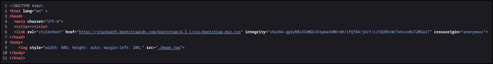
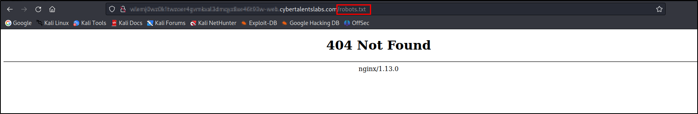
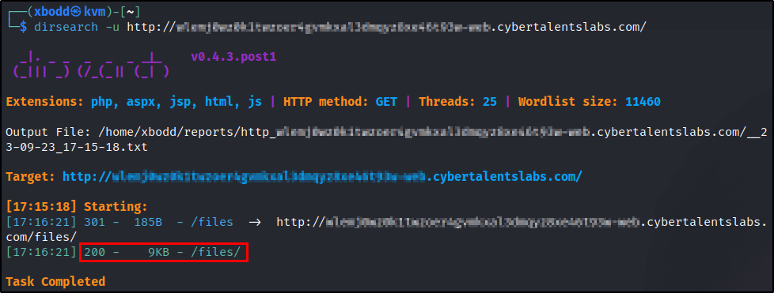
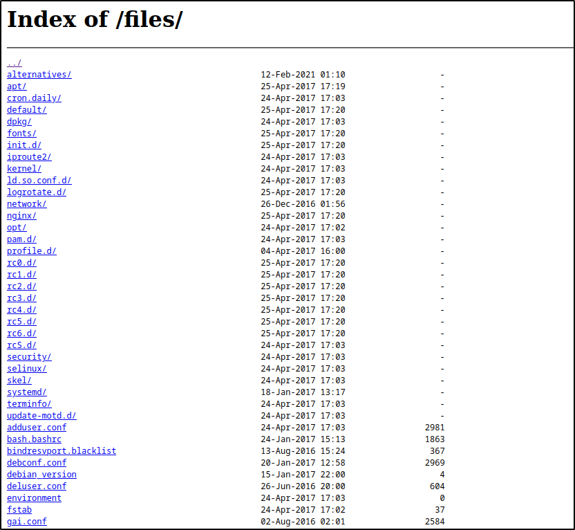
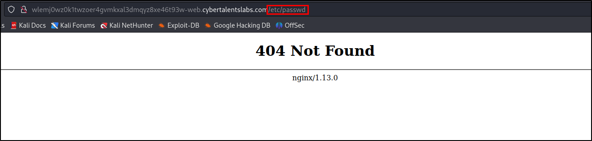
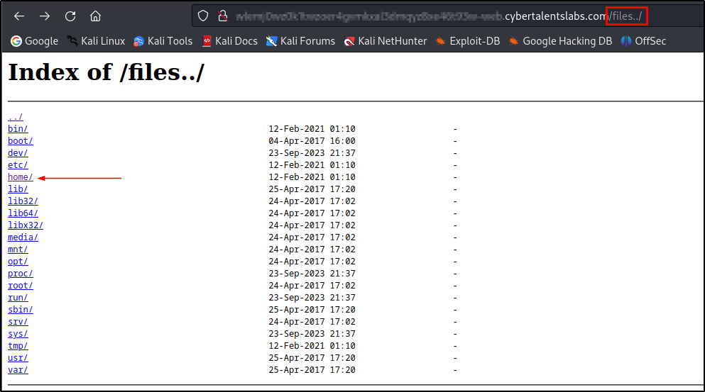
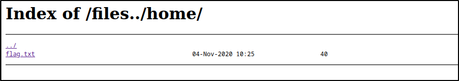

# Bean

## Description
Come back home Mr. Bean.

## Solution

The lab is hosted at CyberTalents website, so I can't share the generated URL.
You can find a similar lab at

**Introduction to Cybersecurity » Directory Traversal » [bean](https://www.vulnhub.com/entry/mr-bean-1,705/)**.

Let's open the URL in the browser.

<p align="center">
    
</p>

Just a photo of Mr. Bean. Let's see the page source.

<p align="center">
    
</p>

Nothing useful again! LEt's see if there is a robots.txt file.

<p align="center">
    
</p>

There is not a robots.txt file. but we got a hint that the website is running on Nginx 1.13.0.

Now, let's try [dirsearch](https://github.com/maurosoria/dirsearch/) to find hidden directories.

<p align="center">
    
</p>

We got a directory named `files`. Let's open it.

<p align="center">
    
</p>

Let’s try to go back to previous directory by using Path Traversal attack, aims to access files and directories that are stored outside the web root folder.

```
http://bean.cybertalentslabs.com/files/../../../../../etc/passwd
```

<p align="center">
    
</p>

It didn't work. Let's try to find a Nginx vulnerability.
I found this [article](https://www.acunetix.com/vulnerabilities/web/path-traversal-via-misconfigured-nginx-alias/) that explains how to exploit Nginx 1.13.0.

```
http://bean.cybertalentslabs.com/files/files../
```

<p align="center">
    
</p>

<p align="center">
    
</p>

We got the flag.

### Flag

```
FLAG{Nginx_nOt_aLWays_sEcUre_bY_The_waY}
```