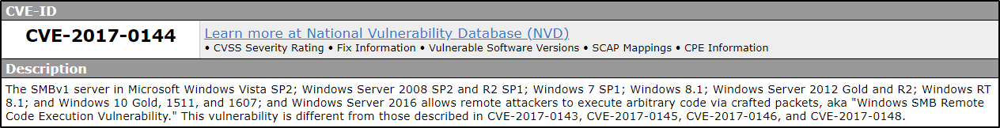

# CVE-Number

## Description

What is the CVE ID that is related to EternalBlue

Flag Format: **XXX-XXXX-XXXX**

## Solution

Just Search for "EternalBlue CVE"

<p align="center"></p>

### Flag

```text
cve-2017-0144
```
