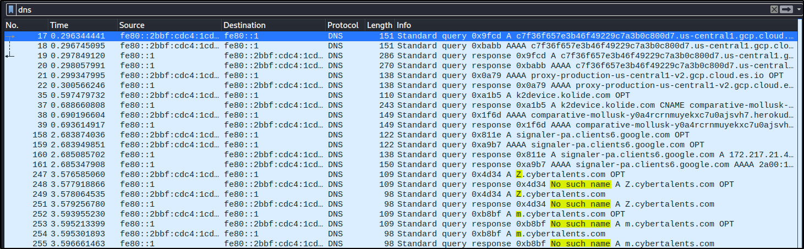

# Creepy DNS

## Description

Our NMS detect a suspected traffic, your task is to investigate the captured traffic and find the anomaly reason

## Files

[dns.pcapng](./dns.pcapng)

## Solution

From the lab title "Creepy DNS" we can find that we should look for a DNS traffic.

<p align="center"></p>

We can notice that there are alot of DNS queries for the domain "cybertalents.com" with a subdomains of just one character and there are no such a name for these queries.

We can try to collect these subdomains and try to find the flag. I wrote a simple bash command to do that using **tshark**.

```bash
tshark -r dns.pcapng | grep -E -o "[a-zA-Z0-9].cybertalents.com" | cut -d "." -f 1 | uniq | tr -d "\n"
```

The output of this command is:

```text
ZmxhZ3t0c2hBcmtfSXNfQXdlczBtZV9OZXR3MHJraW5nX3RvMGx9
```

We can notice that this is a base64 encoded string, so we can decode it using **base64** command.

```bash
echo "ZmxhZ3t0c2hBcmtfSXNfQXdlczBtZV9OZXR3MHJraW5nX3RvMGx9" | base64 -d
```

The output of this command is the flag.

We can combine all the commands in one line.

```bash
tshark -r dns.pcapng | grep -E -o "[a-zA-Z0-9].cybertalents.com" | cut -d "." -f 1 | uniq | tr -d "\n" | base64 -d
```

### Flag

```text
flag{tshArk_Is_Awes0me_Netw0rking_to0l}
```
