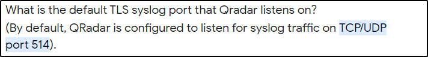

# SIEM Port

## Description
Your company planning to use Qradar as SIEM tool and you planning to receives logs from different different devices like routers, switches and some other devices, What Is The Default TLS Syslog Port That QRadar Listens On?

## Solution

<p align="center">
    
</p>

### Flag
```
flag{514}
```