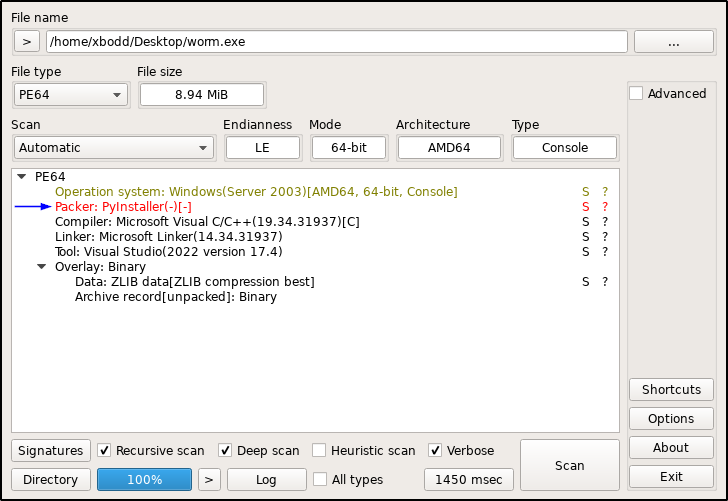
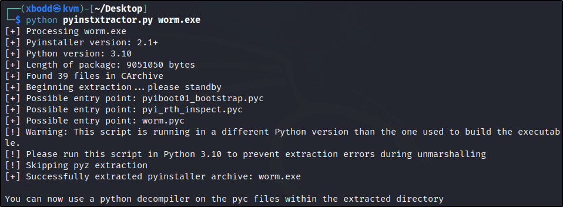
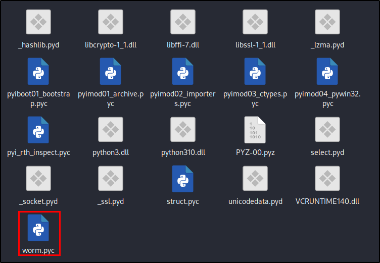
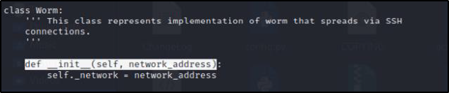
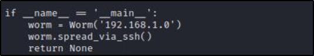

# WormSeen

## Description
OOur EDR has flagged suspicious traffic from production endpoint, after reviewing the respective process generating the traffic and another alert has been alerted “Worm Detected” in our SIEM

You decided to escalate the case to IR team to further investigate and answer the below questions 
* What is the range of worm spreading (x.x.x.x/xx) ?
* Destination target port of the attack (XX)?
* How many hosts might be affected by the worm (XX)?

**Flag format: flag{Answer1:Answer2:Answer3}.**

## Files
[worm.zip](./worm.zip)
* Password: **infected**

## Solution

First of all, we need to extract the zip file using the password **infected**. from that we can find an excutable file called **worm.exe**.

Let's do some basic analysis on this file. I used a program called **[Detect It Easy](https://github.com/horsicq/Detect-It-Easy)** for determining types of file.
 
<p align="center">
    
</p>

As we can see, this file has been packed using **PyINstaller**. So, we need to unpack it using **[PyInstaller Extractor](https://github.com/extremecoders-re/pyinstxtractor)**.

<p align="center">
    
</p>

Now, we can see the unpacked files in the **worm.exe_extracted** folder. 

<p align="center">
    
</p>

Let's see the code in the **worm.pyc** file. To do that we need to uncompyle the file using **[Decompyle++](https://github.com/zrax/pycdc)**.

<p align="center">
    
</p>

<p align="center">
    
</p>

From these details we can find that the destination range is **192.168.1.0/24**, the destination port is the default SSH port **22** and the number of hosts affected is **85**.

**Note**: There is another way to get the flag. We can start Wireshark and run the excutable file "worm.exe" at a windows machine and then we can see the traffic generated by the worm. From that we can get the flag. (But it's not safe to run the excutable file on a real machine)

### Flag

```
flag{192.168.1.0/24:22:85}
```
